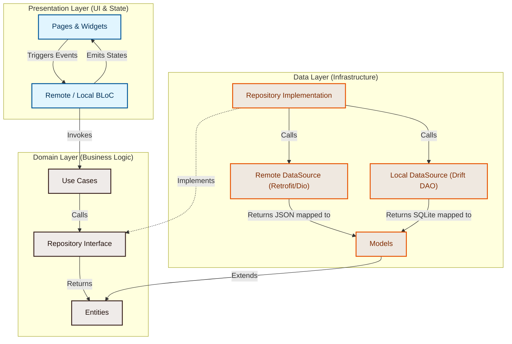

# Daily News — Flutter Clean Architecture Practice

[](https://flutter.dev)
[](https://dart.dev)
[](https://clean-architecture.org)
[](https://bloclibrary.dev)
[](https://drift.simonbinder.eu/)

A professional, cross-platform Flutter application built to explore and practice **Clean Architecture**, state management using **BLoC**, offline caching, database migrations, and modern software design principles in Dart. 

---

## Overview

**Daily News** is a mobile application that fetches the latest headlines from a remote API (NewsAPI) and displays them in a clean, modern user interface. In addition to online reading, the application features a robust bookmarking and offline persistence mechanism, enabling users to save articles for offline access.

The application serves as a concrete, hands-on playground to implement clean segregation between business logic, data mapping, API consumption, and user interface rendering.

---

## Motivation

This project was built out of a desire to bridge the gap between simple, UI-only apps and production-grade software. In typical Flutter projects, developers often mix network calls, UI logic, and state management in a single layer, leading to fragile, hard-to-test codebases. 

By enforcing a strict **Clean Architecture** boundary, this project explores:
- How to write decoupled, modular code that is resistant to platform or library changes (e.g., swapping databases or network clients).
- How to manage asynchronous data streams cleanly using the BLoC pattern.
- How to utilize local SQLite persistence as a local cache source of truth for bookmarked content.
- Best practices in dependency injection (DI) and separation of concerns.

---

## Learning Objectives

Through the lifecycle of this project, several key software engineering concepts and practices are explored:

1. **Layered Separation of Concerns**: Isolating the application into Domain, Data, and Presentation layers.
2. **Dependency Inversion Principle**: Ensuring that the Domain layer (business rules) does not depend on the Data layer (databases, API clients) but instead defines interfaces that the Data layer implements.
3. **Type-Safe Local Persistence**: Leveraging SQLite through Drift (formerly Moor) to generate compiled, safe queries and schema management.
4. **Declarative State Flows**: Implementing the BLoC library to convert UI events (e.g., fetching news, toggling bookmarks) into predictable states.
5. **Modern API Consumption**: Utilizing Retrofit and Dio with custom interceptors to handle HTTP headers, base URLs, and query parameters cleanly.
6. **Graceful Loading & Image States**: Employing skeleton layouts (Skeletonizer) for placeholder loading, and cached network images with error fallback widgets to ensure a premium user experience.

---

## Features

* **Atomic Design System**: A scalable UI architecture organizing components into Atoms, Molecules, and Organisms for maximum reusability and maintainability.
* **Top Headlines Feed**: Fetches real-time, curated daily news articles from the NewsAPI general category in the US.
* **Empty States & UX Handling**: Features premium SVG illustrations and custom empty states for error handling, no-data scenarios, and connection issues.
* **Premium Skeleton Shimmers**: Employs `skeletonizer` to display an organic, matching layout outline while the remote request resolves, avoiding jarring loading spinners.
* **Offline Bookmarking / Caching**: Saves full articles locally to an SQLite database. Saved articles can be read offline even without network connectivity.
* **Bookmark Management & Bulk Delete**: Easily manage saved articles and clear all bookmarked content with a single button.
* **Cached Network Images**: Utilizes `cached_network_image` to cache remote article images on disk, reducing network bandwidth and ensuring images render instantly on repeat visits.
* **Safe Secrets Management**: Utilizes dotenv configuration (`.env`) to load NewsAPI credentials securely without hardcoding them in the source code.

---

## Architecture

This project is structured around the principles of **Clean Architecture** (proposed by Uncle Bob). It strictly divides the codebase into three main layers: **Domain**, **Data**, and **Presentation**.



### 1. Domain Layer (The Core)
The domain layer contains the core business rules of the application. It is completely independent of any external library, framework, or database.
* **Entities**: Plain Dart objects containing business data (e.g., `ArticleEntity` extending `Equatable`).
* **Repositories (Interfaces)**: Defines the contracts for data operations. It does not know *how* data is fetched, only *what* operations are available.
* **Use Cases**: Individual, single-responsibility units of work (e.g., `GetArticleUseCase`, `SaveArticleUseCase`) executing business tasks.

### 2. Data Layer (The Infrastructure)
The data layer implements the interfaces defined in the domain layer. It interacts directly with the API and database.
* **Models**: Entities with serialization and deserialization functions (e.g., `ArticleModel.fromJson`, `ArticleModel.fromTableData`).
* **Data Sources**: Handles low-level network and database calls:
  * *Remote*: `NewsApiService` (generated using `retrofit` and powered by `dio`).
  * *Local*: `ArticleDao` and `AppDatabase` (powered by `drift` SQLite engine).
* **Repositories (Implementation)**: Coordinates data fetching from remote sources, handles error catching, and returns unified `DataState` responses.

### 3. Presentation Layer (The UI)
This layer is responsible for rendering views and handling user interactions. It implements the **Atomic Design Methodology** to ensure high reusability:
* **BLoC**: Receives user actions (Events), processes logic via Use Cases, and emits corresponding UI states (e.g., `RemoteArticlesLoading`, `RemoteArticlesDone`).
* **Atoms, Molecules, & Organisms**: Reusable UI building blocks (e.g., buttons as Atoms, article info sections as Molecules, full article cards as Organisms).
* **Pages & Hooks**: High-level screens built using `HookWidget` for optimized state creation, assembling Organisms into complete views.

---

## Technologies & Dependencies

Here is a breakdown of the core technologies, libraries, and tools utilized in this project:

| Dependency | Purpose | Details |
| :--- | :--- | :--- |
| **Flutter SDK** | Framework | Mobile, Desktop, and Web UI development engine. |
| **flutter_bloc** | State Management | Implements the BLoC pattern to separate presentation from business logic. |
| **get_it** | Dependency Injection | Service locator for clean DI across data, domain, and UI layers. |
| **drift** | Local Database | Reactive, type-safe SQLite database wrapper for Dart/Flutter. |
| **dio** | HTTP Client | Powerful network client supporting interceptors, global configuration, and error catching. |
| **retrofit** | Network Mapping | Code-generation tool to convert REST API endpoints to clean Dart methods. |
| **flutter_hooks** | Hook Widgets | Manages widget lifecycles reactively without boilerplate `StatefulWidget` subclasses. |
| **skeletonizer** | Loading UI | Automatically creates skeleton load placeholders using existing widget structures. |
| **cached_network_image** | Image Loading | Downloads, caches, and renders web images with progress indicators and error fallbacks. |
| **flutter_dotenv** | Configuration | Loads runtime environment configurations safely from `.env` files. |
| **flutter_svg** | Vector Graphics | Renders scalable SVG illustrations for rich empty states and UX components. |
| **build_runner** | Code Generation | Generates code for Retrofit API services and Drift database classes. |

---

## Project Structure

```text
lib/
├── assets/
│   ├── fonts/                 # Custom typography (Inter, WorkSans)
│   └── illustrations/         # SVG graphics for empty states
├── config/
│   └── routes/                # Navigation and routing setup (AppRoutes)
├── core/
│   ├── constant/              # Global API and query constant values
│   ├── database/              # Drift database initialization and sqlite setup
│   ├── env/                   # Environment variable mappings
│   ├── network/               # Custom Dio configurations, interceptors, and clients
│   ├── presentation/          # Core UI Atoms, Molecules, Organisms (Strictly UI Widgets)
│   │   ├── atoms/
│   │   ├── molecules/
│   │   └── organisms/
│   ├── resources/             # Sealed states (DataState, DataSuccess, DataFailed)
│   ├── theme/                 # Global app styling and tokens
│   │   ├── app_theme.dart     # ThemeData configs
│   │   └── tokens/            # Design Tokens (app_colors, app_spacing, app_typography, etc.)
│   └── usecases/              # Base template abstraction for UseCases
├── features/
│   └── daily_news/            # Main feature domain
│       ├── data/
│       │   ├── data_sources/  # Remote (Retrofit) and Local (Drift SQLite DAO) sources
│       │   ├── models/        # JSON parsing and table data model translations
│       │   └── repositories/  # Repository implementations coordinating APIs & DBs
│       ├── domain/
│       │   ├── entities/      # Pure business objects (ArticleEntity)
│       │   ├── repositories/  # Abstract repository contracts (ArticleRepository)
│       │   └── usecases/      # Use cases (*_usecase.dart)
│       └── presentation/
│           ├── bloc/          # Remote (API) and Local (DB) state handlers
│           ├── components/    # Feature-specific UI (Atoms, Molecules, Organisms)
│           └── pages/         # Screens (DailyNews Home, DetailView, SavedArticles)
├── injection_container.dart   # Service locator (GetIt) registrations
└── main.dart                  # Application entry point & configuration setups
```

---

## Getting Started

### Prerequisites
Before running the project locally, ensure you have:
* The **Flutter SDK** installed (v3.12.0 or higher recommended). Check via `flutter --version`.
* An active **NewsAPI Key**. You can register and acquire a free developer key at [newsapi.org](https://newsapi.org).

### Step-by-Step Installation

1. **Clone the Repository**
   ```bash
   git clone https://github.com/adichondro/news_app_clean_architecture.git
   cd news_app_clean_architecture
   ```

2. **Retrieve Project Dependencies**
   ```bash
   flutter pub get
   ```

3. **Configure Environment Variables**
   Create a file named `.env` in the root directory of the project and add your NewsAPI key:
   ```env
   API_KEY=your_actual_news_api_key_here
   ```

4. **Generate Code files (Drift & Retrofit)**
   This project relies on code generation. Run the build runner command to generate the `.g.dart` files for the API service and the SQLite database:
   ```bash
   dart run build_runner build --delete-conflicting-outputs
   ```

5. **Run the Application**
   Start a simulator or connect a physical debugging device and run:
   ```bash
   flutter run
   ```

---


## Future Improvements

As an ongoing learning project, the following enhancements are planned to explore further advanced concepts:

- [ ] **Comprehensive Automated Testing**: Add unit tests for Blocs and Use Cases (using `mocktail`), widget tests for UI elements, and mock network services to achieve robust coverage.
- [ ] **Dual Theme Support (Light / Dark Mode)**: Implement dynamic theme swapping by connecting a local settings Bloc and persisting preference storage.
- [ ] **Multi-language Localization**: Wire up the Flutter localization package to support multiple translation profiles.
- [ ] **Advanced Search & Category Filters**: Provide a search bar in the Daily News feed with scrollable category tabs to dynamic fetch different headlines (e.g., technology, sports).
- [ ] **Network State Observer**: Integrate a network connectivity listener (`connectivity_plus`) to show banner notifications when the user loses internet connection and automatically switch to reading saved articles.

---

## Lessons Learned

- **Decoupled Architecture Prevents Spaghetti Code**: Although separating folders into data, domain, and presentation requires writing more initial files (like UseCases and models), it pays off immediately when debugging or changing UI layout, as it reduces cross-class side effects.
- **Drift makes SQL Easy**: Generating schema helpers automatically ensures that SQL syntax errors are caught at compile time rather than crashing the database engine at runtime.
- **State Management Simplifies UI**: By using Blocs, views remain simple and declarative. They just build the interface based on the state emitted, which drastically reduces the complexity of handling user gestures and loading screens.

---

## Disclaimer

> [!IMPORTANT]
> **Educational & Learning Project Sandbox**
>
> * This project was created primarily as a **personal learning and practice project** to explore modern software development concepts and improve programming skills.
> * The features are implemented as part of a learning process rather than to create a production-ready application.
> * The project is used to practice software engineering best practices including Clean Architecture, state management, dependency injection, API integration, local database management, error handling, etc.
> * The codebase will continue to evolve, be refactored, or contain experimental implementations as new concepts are discovered.
> * It serves as an active portfolio of software exploration and learning progress.

---
*Created by [adichondro](https://github.com/adichondro) as a learning experiment.*
